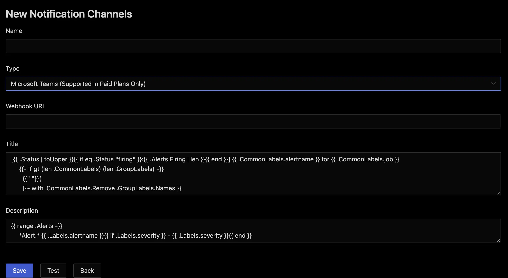

## Prerequisite

Before configuring Slack as a notification channel in SigNoz, ensure that you have:
- **Incoming Webhook**: Follow the steps outlined in [ Microsoft Teams documentation](https://docs.microsoft.com/en-us/microsoftteams/platform/webhooks-and-connectors/how-to/add-incoming-webhook) to create an incoming webhook and obtain the necessary webhook URL.
- **SigNoz Version**: [v0.26.0](https://github.com/SigNoz/signoz/releases/tag/v0.26.0) or later.

## Accessing Alert Channels

To manage your alert channels in SigNoz:

- Navigate to `Settings > Alert Channels` tab within SigNoz. This tab displays a list of configured alert channels.

:::info

When multiple channels are set up, alerts will be sent to all the configured channels.

:::

## Creating a new Notification channel

- Navigate to `Settings > Alert Channels` and click on `New Channel`.
- Enter a **Name** for the channel and select Slack as the channel type.
- **Webhook URL**: Paste the Incoming Webhook URL pbtained from Microsoft Teams.

**Note**: You can use [Go templates](https://prometheus.io/docs/alerting/latest/notifications/) for customizing the title and description.

**Test Configuration**: 
Verify the configuration by clicking the Test button. This sends a test alert to Microsoft Teams, ensuring that SigNoz alert manager can communicate with your MS Teams setup.

## Editing a Notification channel 

To edit an existing Slack notification channel:
- Navigate to the channel settings in SigNoz.
- You can edit the MS Teams webhook URL and other parameters. However, note that the channel name and type are not editable after creation.

## Receive Alert in MS Teams
Once configured correctly, alerts from SigNoz will appear in Microsoft Teams whenever monitored metrics cross the thresholds specified in your alert rules. This setup ensures that you are promptly alerted to any issues in your applications or infrastructure components.

## Troubleshooting
If you encounter issues with the Microsoft Teams integration:

- **Check the Webhook URL**: Ensure that the webhook URL entered in SigNoz matches the one provided by Microsoft Teams.
- **Verify MS Teams Configuration**: Confirm that the incoming webhook in Microsoft Teams is correctly set up and active.
- **Test Connectivity**: Use the Test button in SigNoz to check connectivity with Microsoft Teams. If the test fails, review your network settings and webhook URL.

:::tip

If you encounter any unexpected challenges during the use of this integration, please contact SigNoz Support at support@signoz.io

:::